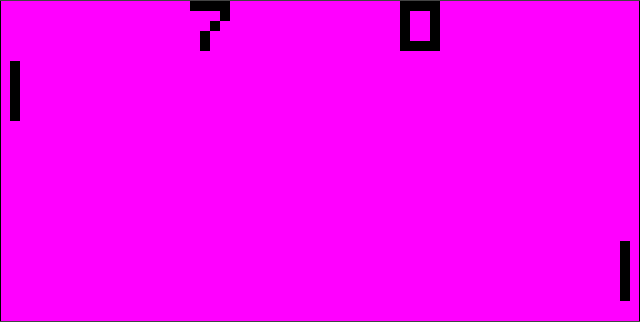
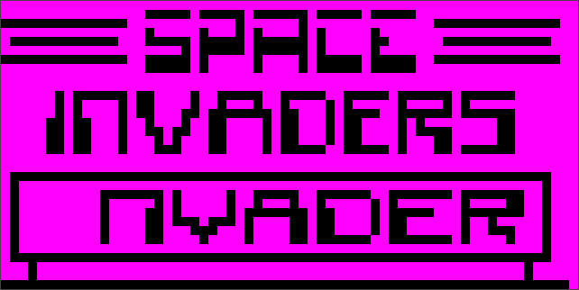
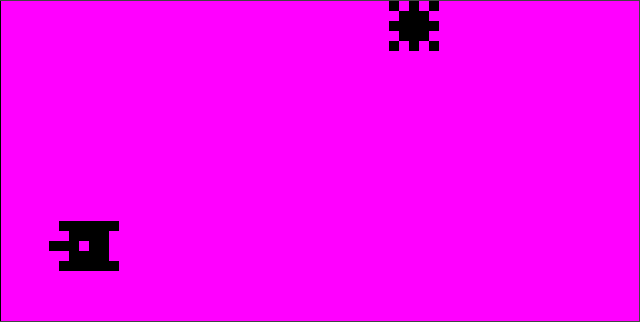

# chip8-emu
bare bones implementation of [CHIP-8](https://en.wikipedia.org/wiki/CHIP-8) emulator using OpenGL rendering with [SDL2](https://www.libsdl.org/) window.
Can be build for linux/unix, but there is not many dependencies so windows build should be fairly straigh forward

# images

Pong game

Invaders game

Bliz game

